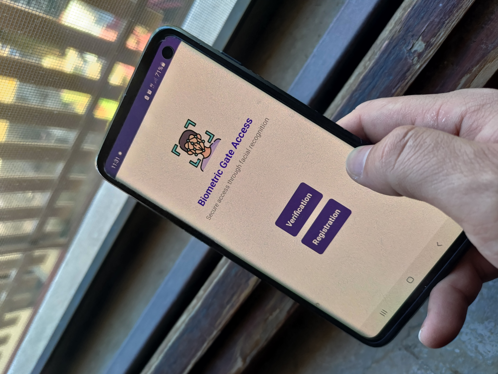
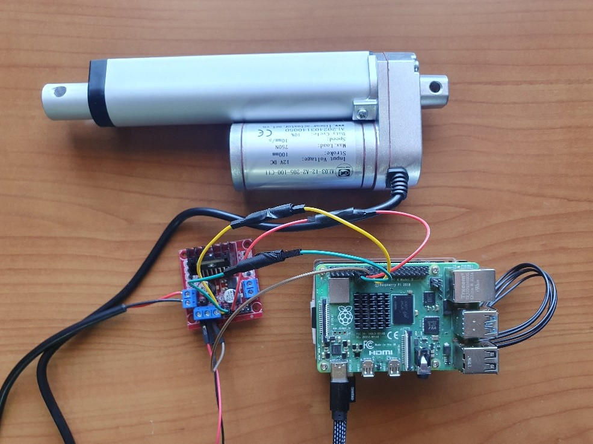
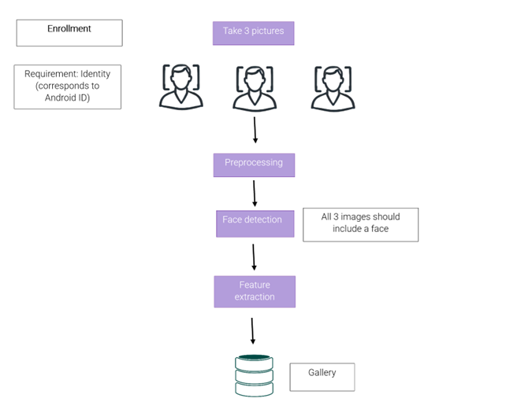
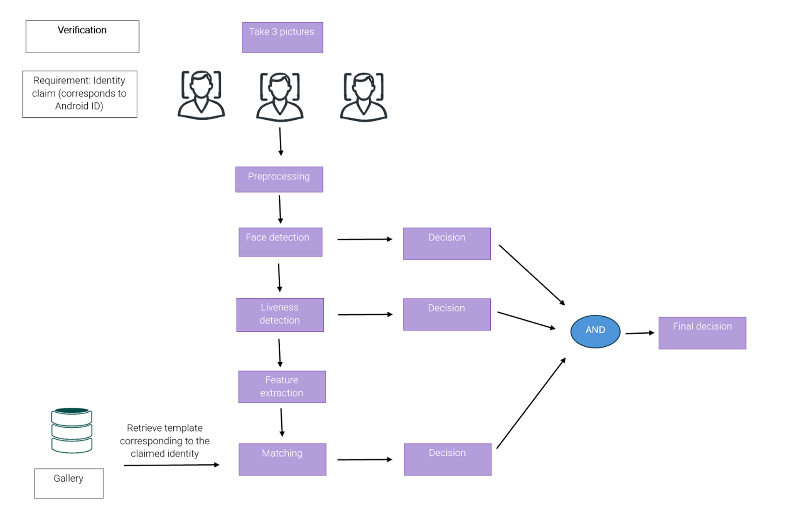

# 🔐 Biometric Gate Access  
**Secure, convenient, and automated access control with facial biometrics**  

---

## 🌍 Context & Motivation  

In today’s world, **convenience without compromising security** has become essential.  
Biometrics provide an **ideal and efficient solution**, combining **automation, safety, and user comfort**.  

➡️ This led us to design an **Android application** capable of:  
- 🚪 Opening/closing gates  
- 🔑 Locking/unlocking doors  

…all performed **rapidly through facial recognition**, offering a **secure, user-friendly, and automated access system**.  

  

---

## 🏗️ System Architecture  

The application relies on **three key modules**, executed on a dedicated server:  

### 1️⃣ Face Detection 👀  
- Detects the presence of a face in the images captured by the Android device’s camera.  
- Uses **MTCNN** (from *FaceNet-PyTorch*) for reliable and efficient detection.  

### 2️⃣ Liveness Detection 🛡️  
- An **anti-spoofing module** ensuring the detected face belongs to a **live person**.  
- Prevents:  
  - 🖨️ **Print Attacks** → attempts using printed photos  
  - 📽️ **Replay Attacks** → attempts using recorded videos of genuine users  
- Implemented with **PyTorch**, using **MobileNet_v2** (with and without *Local Binary Pattern* preprocessing) for robust performance.  

### 3️⃣ Face Recognition 🤝  
- Extracts facial embeddings via **deep learning**.  
- Uses **FaceNet-PyTorch** (Inception Resnet V1, pre-trained on *VGGFace2* & *CASIA-WebFace*).  
- Performs **verification** (1:1 comparison) to check if the declared identity matches the stored template.  
- ✅ Accept → if embeddings match  
- ❌ Reject → otherwise  

---

## 📡 Hardware Integration  

The **Android application communicates with a Raspberry Pi** through an **HTTP Flask server**.  

- ⚙️ **Raspberry Pi GPIO Pins** connect to a **motor driver (L298N)**.  
- The **L298N driver** controls a **linear actuator**, responsible for:  
  - 🏡 Pressing the intercom button to open/close a gate  
  - 🚪 Engaging or disengaging door latches  

This setup bridges **biometric authentication** with **physical control mechanisms**.  

  

---

## 🔑 Enrollment & Verification Policies  

The biometric pipeline consists of **two main phases**:  

### 📝 Enrollment Phase  
- The system requires **three face images** from the user.  
- ✅ Only if all three images contain a valid face → proceed to **feature extraction & template creation**.  
- ❌ Otherwise → request the user to retake the images.  
- Templates are stored on the server and linked to the user’s **Android ID** (unique device identifier).  

  

### 🔎 Verification Phase  
- Similarly, the system requires **three face images** for verification.  
- Images undergo **preprocessing** (resizing & normalization).  
- ✅ Pipeline flow:  
  1. **Face Detection** → if any image fails → `reject`  
  2. **Liveness Detection** → if any image is spoofed → `reject`  
  3. **Face Recognition** → compare extracted features against stored templates (linked to Android ID)  
     - If match → `accept`  
     - Else → `reject`
    

  

This **multi-step verification policy** ensures **accuracy, robustness, and resistance to spoofing attacks**.  

---

## ⚙️ Technologies Used  

- **Android App** 📱 → User interface & camera capture  
- **Server** 🖥️ → Manages face detection, liveness, and recognition  
- **Raspberry Pi + L298N** 🔧 → Physical actuation (gates & doors)  
- **Libraries & Frameworks**:  
  - [PyTorch](https://pytorch.org/) → Training & evaluation of models  
  - [FaceNet-PyTorch](https://github.com/timesler/facenet-pytorch) → Face recognition & detection (MTCNN, Inception Resnet V1)  
  - [MobileNet_v2](https://pytorch.org/vision/stable/models/generated/torchvision.models.mobilenet_v2.html) → Liveness detection model  
  - [Local Binary Pattern (LBP)](https://en.wikipedia.org/wiki/Local_binary_patterns) → Image preprocessing for robustness  

---

## 🧠 Machine Learning Approach  

- 🟣 **Deep Learning Models** used for all three biometric modules  
- ⚡ **GPU acceleration** with PyTorch for efficient tensor operations  
- 📊 Models evaluated **with and without preprocessing** (LBP) for liveness detection  
- 🏆 Chosen architecture ensures:  
  - High accuracy ✅  
  - Real-time processing ⏱️  
  - Strong resistance against spoofing attempts 🔒  

---

## 📂 Dataset Preparation  

To properly evaluate and train the different modules of our biometric access system, we combined **public datasets** with a **manually created dataset**.  

### 👀 Face Detection Dataset  
- **Positive class**: Images from  
  - 📷 Labelled Faces in the Wild (LFW)  
  - 🖼️ NUAA Photograph Imposter Database  
  - 🎥 MSU-MFSD  

- **Negative class**: Manually collected confusing examples, such as:  
  - 🐶🐱🐴🦁🐘 Animals (dogs, cats, horses, lions, elephants)  
  - ⚽🏐 Round or oval objects (balls, spheres)  

👉 This design ensured the model faced **challenging scenarios**, simulating objects with **facial-like structures**.  

---

## 🧠 Face Detection Module  

We implemented **MTCNN (Multi-task Cascaded Convolutional Networks)** for face detection.  

- **Evaluation set**: 6000 manually prepared images  
- **Results**:  
  - ❌ False Positive Rate (FPR): **2.47%**  
  - 🎯 Missed Face Rate (MFR): **0.00%**  

✅ The **0.00% MFR** demonstrates that the model **never failed to detect a human face**.  
⚠️ False positives occurred mainly with **animals or spherical objects** deliberately included to confuse the model.  

---

## 🛡️ Liveness Detection Module  

We trained **MobileNet_v2** (with a custom final layer for binary classification: *real vs. spoof*) using the **NUAA** and **MSU-MFSD** datasets.  

### ⚙️ Training Setup  
- 🔄 **10 epochs**  
- 📦 Batch size: **32**  
- 📉 Learning rate: **0.0001**  
- 🔍 Tested **with and without Local Binary Pattern (LBP) preprocessing**  

### ✨ Why LBP?  
- Emphasizes **texture details**  
- Highlights **printing defects** in photo attacks  
- Detects surface differences (e.g., light reflection, unnatural colors)  

### 🧪 Experiments  
- ✅ Trained MobileNet with/without LBP on one dataset, evaluated on the other (**cross-dataset evaluation**)  
- ✅ Tested models on **unseen partitions** from the same dataset  
- 📏 Metrics used:  
  - 🔹 APCER (Attack Presentation Classification Error Rate)  
  - 🔹 BPCER (Bona Fide Presentation Classification Error Rate)  
  - 🔹 ACER (Average Classification Error Rate)  
  - 🔹 Accuracy, Precision, Recall, F1-score  

### 📊 Findings  
- **High performance** when tested on the same dataset used for training  
- **Performance drop** on cross-dataset evaluation, due to differences in:  
  - 🌗 Lighting conditions  
  - 👤 Subject diversity  
  - 📱 Capture devices (smartphones, tablets, laptops)  
- **Best results**: Training on a **combined dataset** → improved generalization, robust even **in real-time scenarios**  

---

## 🧾 Face Recognition Module  

For **face recognition**, we used **Labelled Faces in the Wild (LFW)** and performed a **verification single-template ALL-against-ALL evaluation**.  

### ⚙️ Experimental Setup  
- 8 experiments conducted  
- Compared:  
  - 📊 **CASIA-WebFace pre-trained model**  
  - 📊 **VGGFace2 pre-trained model**  
- Variable **S**: number of templates per subject  
- Metrics visualized through:  
  - FAR (False Acceptance Rate) vs. FRR (False Rejection Rate)  
  - 📈 **ROC curve**  
  - 📉 **DET curve**  
  - Equal Error Rate (EER) point  

### 📊 Results  

#### VGGFace2  
- Outperformed CASIA-Webface across all values of **S**  
- **Best case (S=3)**:  
  - GAR (Genuine Acceptance Rate): **0.97**  
  - GRR (Genuine Rejection Rate): **0.97**  
  - ✅ Excellent recognition ability  
  - ROC Curve → **AUC = 1.0** (near-perfect performance)  
  - DET Curve → Low FAR and FRR, minimal errors  

#### CASIA-Webface  
- Performance **deteriorated with higher values of S**  
- Struggled with **intra-class variations**:  
  - Different poses  
  - Lighting changes  
  - Facial expressions  
- These limitations were more evident in **uncontrolled conditions** (like LFW dataset images).  

---

## Authors
- [@Pnlalessio](https://github.com/Pnlalessio)  
- [@JessicaFrabotta](https://github.com/JessicaFrabotta)

---
